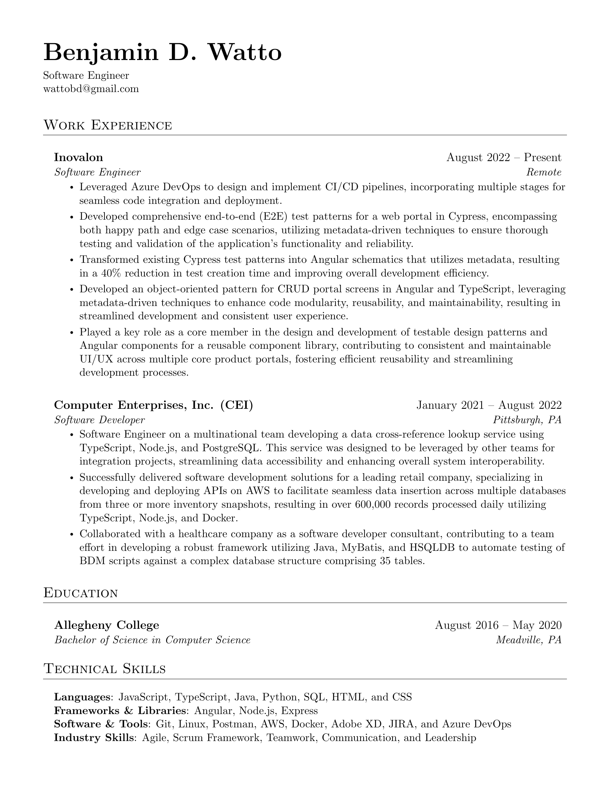

# Hi there 👋 

## Introduction
I'm Benjamin, a passionate coder with a keen interest in gaming. I believe in writing clean, efficient code that solves real-world problems.

## Current Activities
- 🔭 I’m currently working on a full-stack application using Angular for the frontend, AWS DynamoDB for data storage, and AWS Lambda functions for serverless backend operations. It's exciting because I'm pushing the boundaries of serverless architecture, optimizing performance, and exploring seamless integration with Angular.
- 🌱 I’m currently learning more about AWS services, particularly DynamoDB and Lambda. Always eager to expand my knowledge and explore new technologies.

## Skills and Technologies
- 💻 I'm proficient in JavaScript, TypeScript, Java, & Python. My go-to languages are Python and JavaScript.
- 🚀 I enjoy working with Angular for building robust web applications and Cypress for end-to-end testing. Currently diving deep into AWS DynamoDB for efficient NoSQL data storage and AWS Lambda for serverless computing.

<!-- ## Projects
Here are some projects I'm proud of:
1. [Project 1](link-to-project-1): Brief description of the project.
2. [Project 2](link-to-project-2): Brief description of the project. -->

## Connect with me
- [LinkedIn](https://linkedin.com/in/benjaminwatto/) 
- [GitHub](https://github.com/wattob) 
- [Stack Overflow](https://stackoverflow.com/users/10458181/ben) 
- [Facebook](https://facebook.com/wattobenjamin) 
- [Twitter](https://twitter.com/wattobd) 
- [Instagram](https://instagram.com/benjamindwatto/) 

## Contact
📫 How to reach me: wattobd@gmail.com

## Fun Fact
⚡ Fun fact: I'm a dog lover, and I have a golden retriever named Bella. She's my coding companion, always sitting under my desk during coding sessions.

## GitHub Stats

